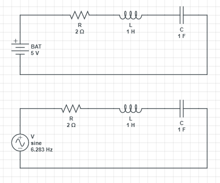

### Simulation of RLC Series Circuit using Numerical Methods

This repositoy focuses on solving for the current of the above circuit during the transient state.

The differential equation obtained for solving the current is as follows.

### Exact Solution
The exact solution of the above differential equation according to wolfram alpha is:

[Euler's method](https://en.wikipedia.org/wiki/Euler_method) is used to implement the numerical solution for the above equation which after a certain extent outputs nearly exact solution with not much computational power. 
This [article](https://medium.com/@afhamaflal9/numerical-solution-to-rlc-series-circuit-with-constant-and-varying-source-11637e05e8c) contains further information.
